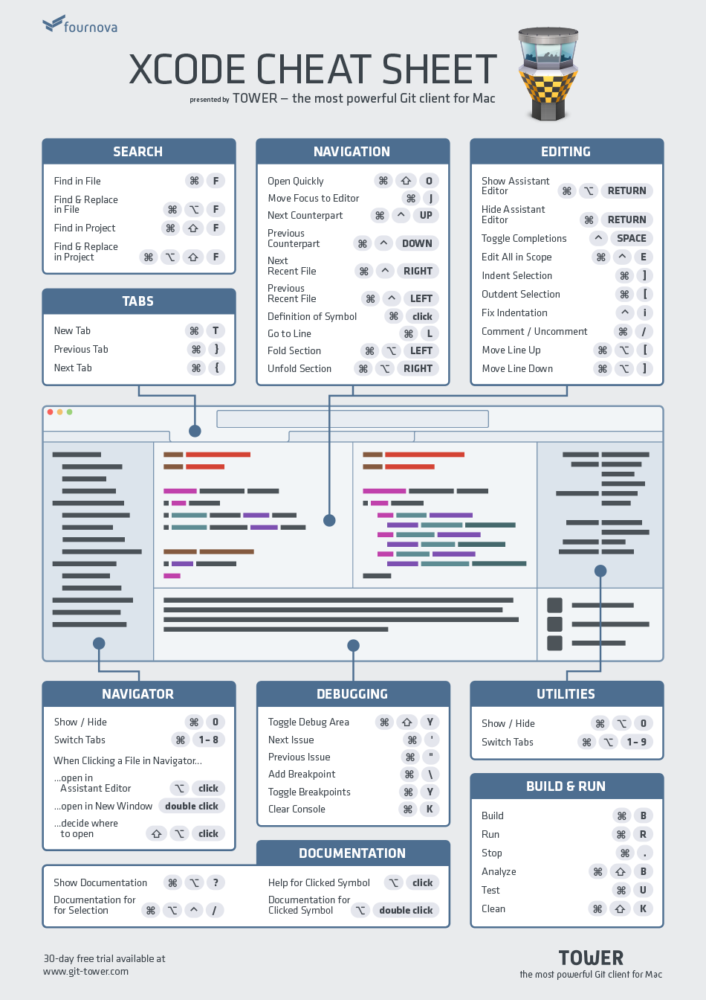
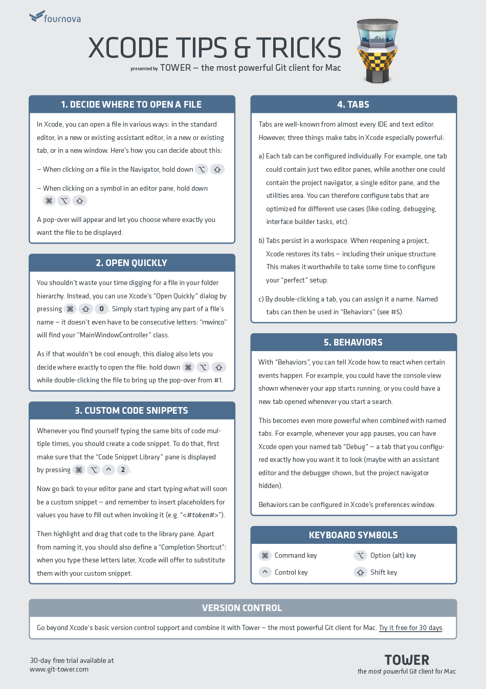

cmd = Command  ctrl = control  sft = shift   opt = Option   * = click 

##  好用的

-   切换 辅助/标准 编辑 : cmd + 回车 / cmd + opt + 回车
-   隐藏/打开 导航器 cmd + 0  |   隐藏/打开 单元区域 cmd + opt + 0
-   查找: cmd + f  查找替换 cmd | opt +f   项目查找 cmd + sft + f  项目查找替换 cmd | sft + opt + f  查找文档 cmd + sft + / 
-   全屏 cmd + ctrl + f
-   拼写检查 cmd + :
-   焦点切换 cmd + j
-   定位到导航栏 cmd + sft + j
-   跳转到方法或代码的实现 cmd +ctrl + j
-	清除控制台信息 cmd + k

##  常用且好记的

-	快速打开 cmd+sft+o
-	快速文档 opt+* or ** |  三指点击  
-	跳转至定义 cmd + *
-	.m和.h文件切换 cmd+ctrl + 上 or 下

-	导航器面板切换 cmd + 1，2，3，4，5，6，7，8
-	单元区域切换 cmd+opt + 1，2，3，4，5，6，7，8
-	显示/隐藏调试区域 cmd + sft + Y  / 焦点到输入控制台 cmd + sft + c
-	添加/删除断点 cmd + \
-   激活/禁用全部断点 cmd + y
-   opt+cmd+r：编辑配置（Edit Scheme）

##  不常用的

##  代码编辑

-   缩进 cmd + [ or ]
-	注释 cmd + /
-	匹配代码区域 ：双击某个分隔符（如()、[]、{} 等）
-	启动和停止 cmd + r | cmd + .
-	在自定义尺寸导航到代码 cmd + sft + opt + * 
-   跳转到行 cmd + l 

##  快速预览图

